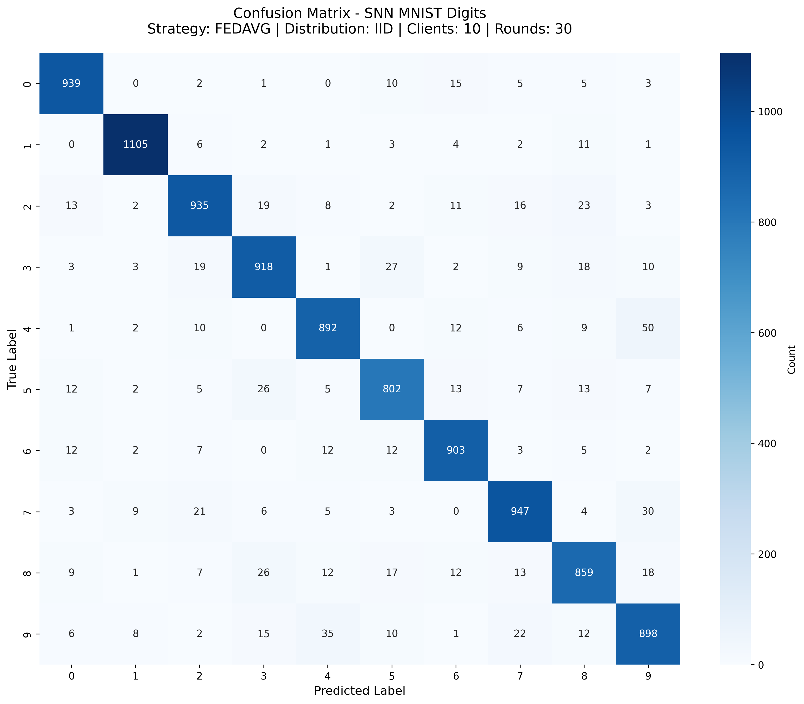
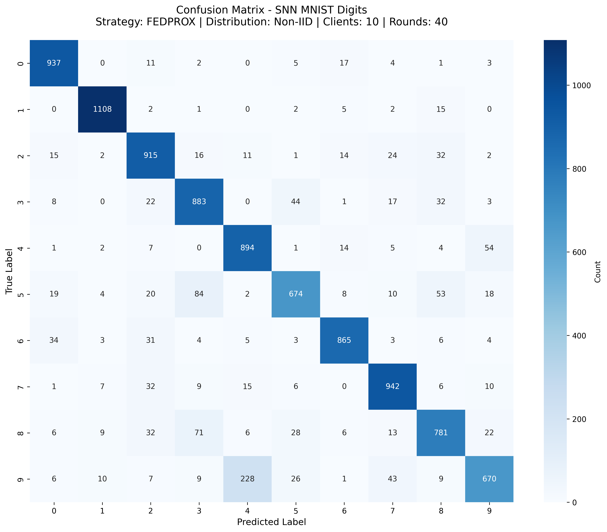

# Results

This document contains confusion matrix analysis for experiments conducted using **Spiking Neural Networks (SNNs)** on the MNIST dataset with different federated learning strategies.

---

## 📊 Summary Table

| Model | Strategy | Clients | Rounds | Data | Accuracy | Best Class | Worst Class |
|-------|----------|---------|--------|------|----------|------------|-------------|
| SNN   | FedAvg   | 10      | 30     | IID  | **91.98%** | Digit 1 (97.36%) | Digit 8 (88.19%) |
| SNN   | FedProx  | 10      | 40     | Non-IID | **86.69%** | Digit 1 (97.62%) | Digit 9 (66.40%) |

---

## 🔹 Experiment 1: FedAvg (IID)

- **Model:** SNN  
- **Dataset:** MNIST  
- **Strategy:** FedAvg  
- **Clients:** 10  
- **Rounds:** 30  
- **Accuracy:** 91.98%  

### Confusion Matrix

```
### Detailed Report
================================================================================
CONFUSION MATRIX ANALYSIS RESULTS
================================================================================
Generated on: 2025-09-07 10:57:44

MODEL CONFIGURATION
----------------------------------------
Model Type: SNN
Dataset: MNIST
Strategy: FEDAVG
Number of Clients: 10
Number of Rounds: 30
Data Distribution: IID
Learning Rate: 0.001
Local Epochs: 2
Local Batch Size: 32
SNN Timesteps: 25

OVERALL PERFORMANCE
----------------------------------------
Test Accuracy: 0.9198 (91.98%)
Total Test Samples: 10000
Correctly Classified: 9198
Misclassified: 802

PER-CLASS PERFORMANCE
----------------------------------------
Class           Accuracy   Support  Correct 
---------------------------------------------
Digit 0         0.9582     980      939     
Digit 1         0.9736     1135     1105    
Digit 2         0.9060     1032     935     
Digit 3         0.9089     1010     918     
Digit 4         0.9084     982      892     
Digit 5         0.8991     892      802     
Digit 6         0.9426     958      903     
Digit 7         0.9212     1028     947     
Digit 8         0.8819     974      859     
Digit 9         0.8900     1009     898     

Best Class: Digit 1 (0.9736)
Worst Class: Digit 8 (0.8819)


DETAILED CLASSIFICATION REPORT
----------------------------------------
              precision    recall  f1-score   support

     Digit 0     0.9409    0.9582    0.9494       980
     Digit 1     0.9744    0.9736    0.9740      1135
     Digit 2     0.9221    0.9060    0.9140      1032
     Digit 3     0.9062    0.9089    0.9076      1010
     Digit 4     0.9186    0.9084    0.9135       982
     Digit 5     0.9052    0.8991    0.9021       892
     Digit 6     0.9281    0.9426    0.9353       958
     Digit 7     0.9194    0.9212    0.9203      1028
     Digit 8     0.8957    0.8819    0.8888       974
     Digit 9     0.8787    0.8900    0.8843      1009

    accuracy                         0.9198     10000
   macro avg     0.9189    0.9190    0.9189     10000
weighted avg     0.9198    0.9198    0.9198     10000

```


## 🔹 Experiment 2: FedProx (Non-IID)

- **Model:** SNN  
- **Dataset:** MNIST  
- **Strategy:** FedProx (mu=1.0)  
- **Clients:** 10  
- **Rounds:** 40  
- **Accuracy:** 86.69%  

### Confusion Matrix


### Detailed Report
```
================================================================================
CONFUSION MATRIX ANALYSIS RESULTS
================================================================================
Generated on: 2025-09-07 10:57:07

MODEL CONFIGURATION
----------------------------------------
Model Type: SNN
Dataset: MNIST
Strategy: FEDPROX
Number of Clients: 10
Number of Rounds: 40
Data Distribution: Non-IID
Learning Rate: 0.001
Local Epochs: 2
Local Batch Size: 32
SNN Timesteps: 25
FedProx Mu: 1.0

OVERALL PERFORMANCE
----------------------------------------
Test Accuracy: 0.8669 (86.69%)
Total Test Samples: 10000
Correctly Classified: 8669
Misclassified: 1331

PER-CLASS PERFORMANCE
----------------------------------------
Class           Accuracy   Support  Correct 
---------------------------------------------
Digit 0         0.9561     980      937     
Digit 1         0.9762     1135     1108    
Digit 2         0.8866     1032     915     
Digit 3         0.8743     1010     883     
Digit 4         0.9104     982      894     
Digit 5         0.7556     892      674     
Digit 6         0.9029     958      865     
Digit 7         0.9163     1028     942     
Digit 8         0.8018     974      781     
Digit 9         0.6640     1009     670     

Best Class: Digit 1 (0.9762)
Worst Class: Digit 9 (0.6640)


DETAILED CLASSIFICATION REPORT
----------------------------------------
              precision    recall  f1-score   support

     Digit 0     0.9124    0.9561    0.9337       980
     Digit 1     0.9677    0.9762    0.9719      1135
     Digit 2     0.8480    0.8866    0.8669      1032
     Digit 3     0.8184    0.8743    0.8454      1010
     Digit 4     0.7700    0.9104    0.8343       982
     Digit 5     0.8532    0.7556    0.8014       892
     Digit 6     0.9291    0.9029    0.9158       958
     Digit 7     0.8862    0.9163    0.9010      1028
     Digit 8     0.8317    0.8018    0.8165       974
     Digit 9     0.8524    0.6640    0.7465      1009

    accuracy                         0.8669     10000
   macro avg     0.8669    0.8644    0.8634     10000
weighted avg     0.8683    0.8669    0.8653     10000
```
